# SQL-Analysis-of-Chelsea-2021-2022-Season-

Hello there. I saw this Analysis on a die hard chelsea fan Project and decided to replicate and also give it a try :stuck_out_tongue_closed_eyes: The analysis of the  most used first 11 during the 2021–2022 season and play around with the data in SQL Server. Now lets get right into this :hand_over_mouth:

Lets start by creating our Database:

We can now see that the Database has been effected.

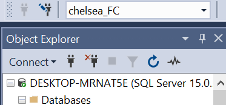

Now let us create 2 tables
- Player_Stats
- Player_Attributes

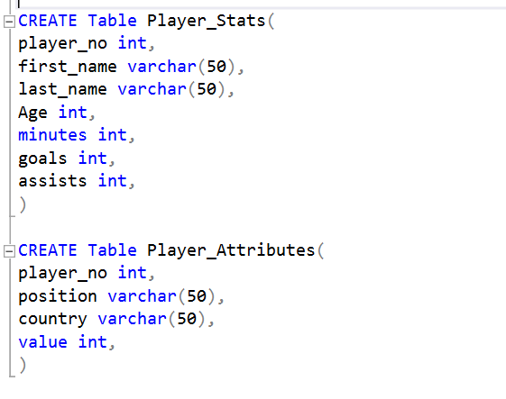

looks like our table will be empty :raised_eyebrow:
Lets Populate 

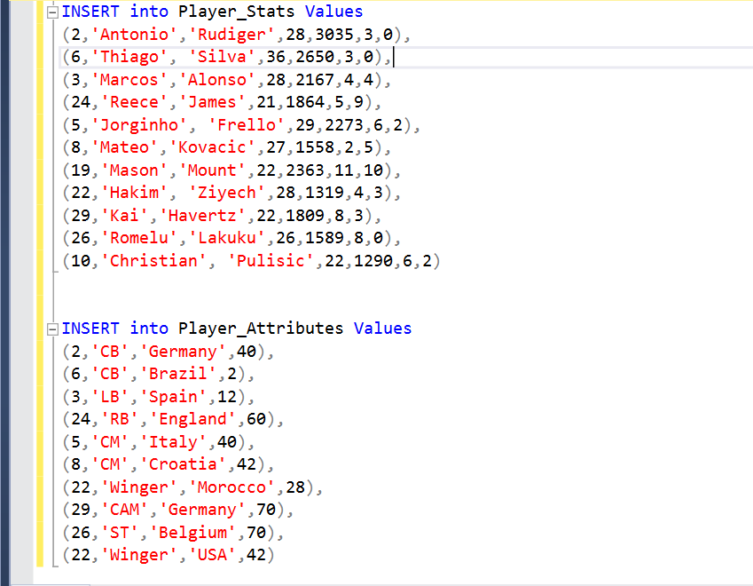

We can view our tables together right! Lets have a look

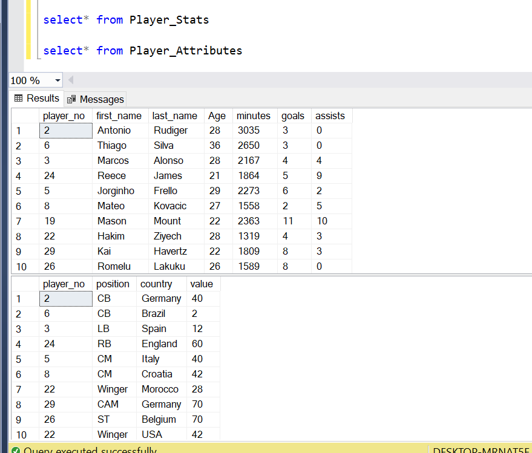

1.   Now let's add another column **Full-name**.
We want to Alter the table, so that other columns created will still be intact, and the command will just modify the table. We have it below 👇

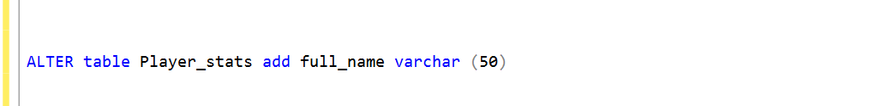

After then, we can write the Concatenate function, to combine 2 of the columns together. The full_name and the last_name Column.

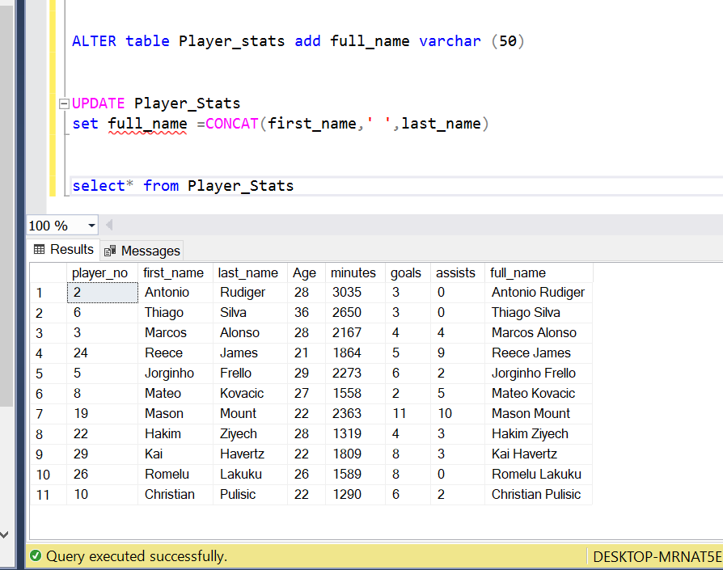

We can see that the change was effected. Aright!

2. The next column we will be adding is the **GA** Column i.e (goals+assists) still using the Alter command, i wanted to modify the table while still Updating it to automatically sum up the goals+assists column. Then we have this 👇

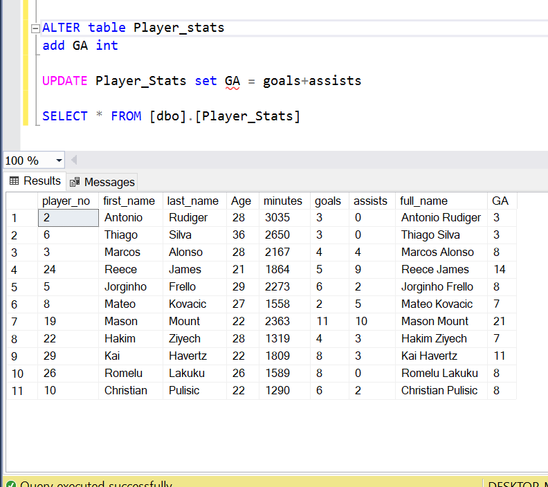

3. minutes_per_goal Column (goal/minutes)

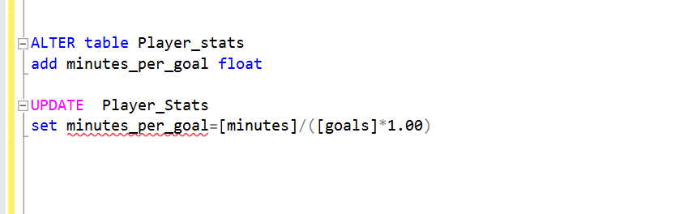

4. minutes_per_GA (GA/minutes) 

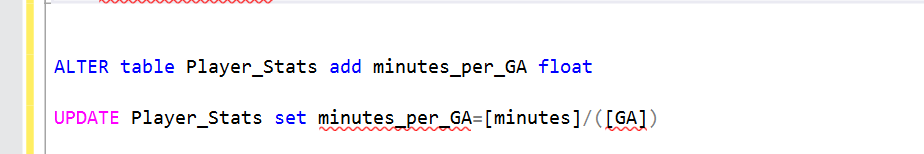

Lets now view our newly added Columns.

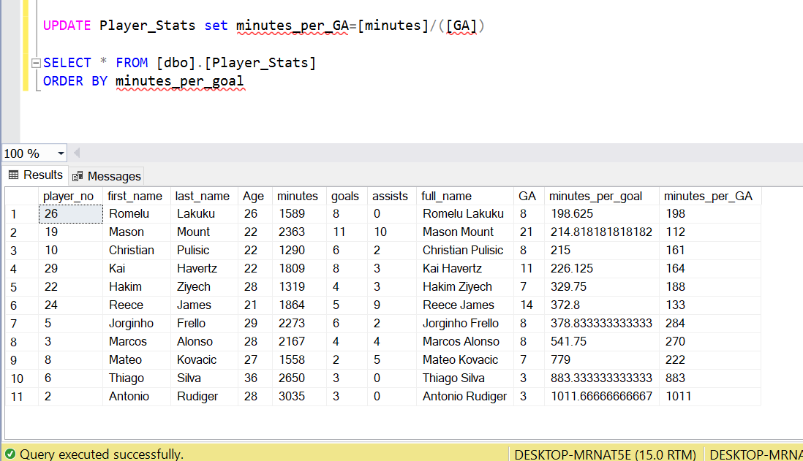

Now, we want to **round** the newly added columns using the round function. see below 👇

minutes_per_goal column

minutes_per_GA column

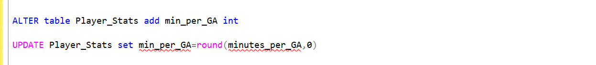

Now, lets see the effects made

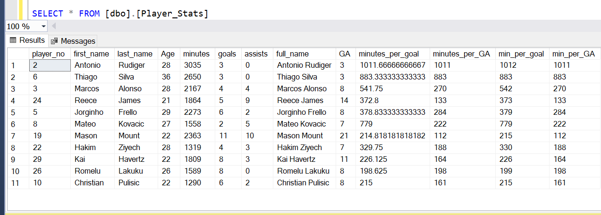

Let's drop the 2 Columns with decimal places
minutes_per_goal and minutes_per_GA Column

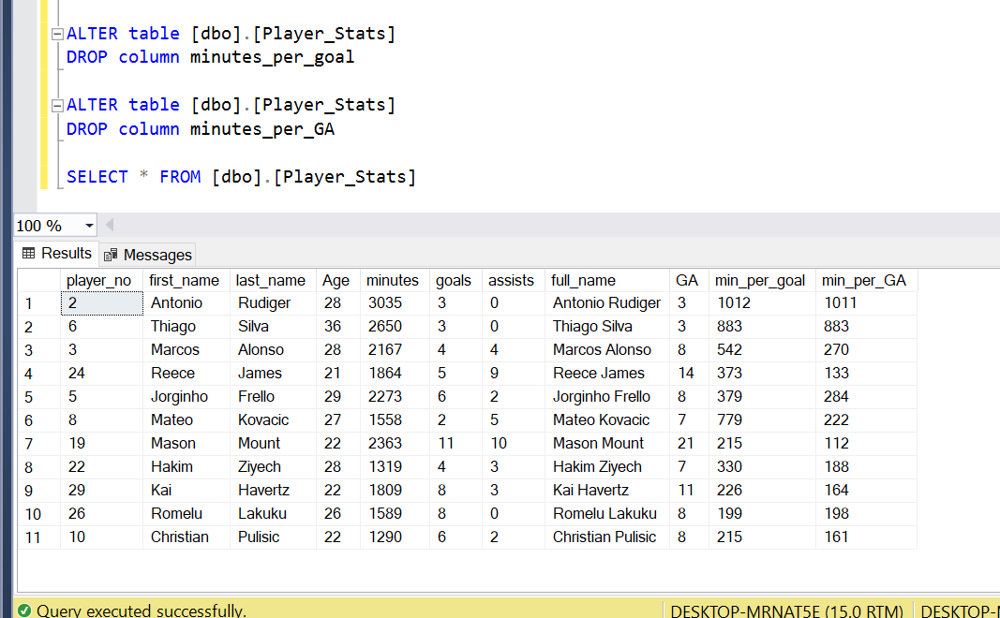

Next, we want to change a Column name in Player_Attributes so i am going to be using the sp(stored procedure)command. Have a look at it.

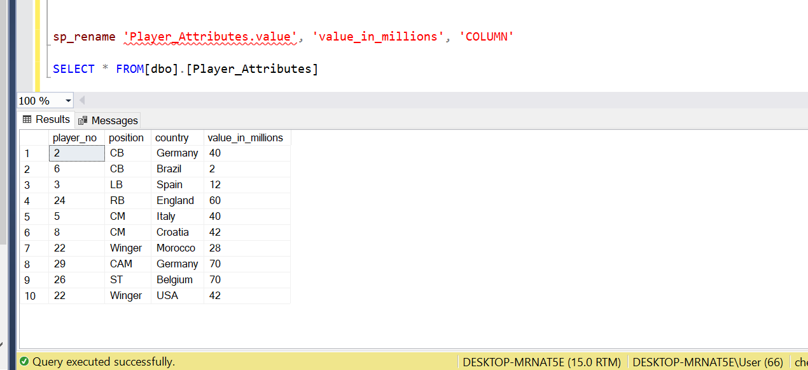

There are some corrections we need to make. we want to change Lakuku's player_no from 29 to 9.

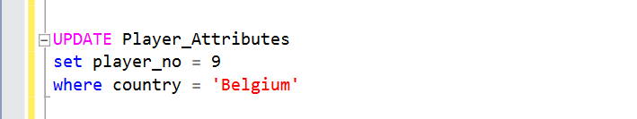

Now, we want to update a column in our  player_Stats table

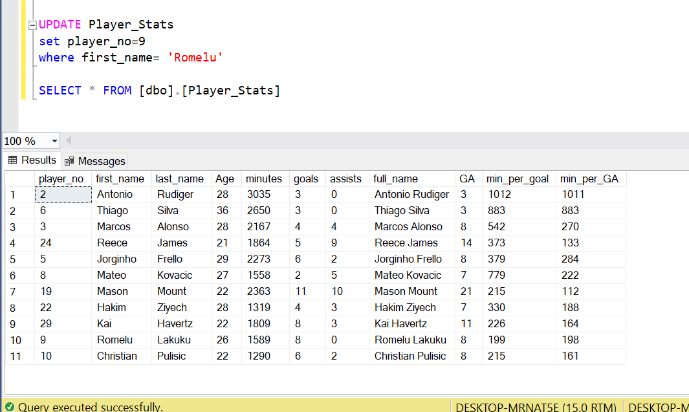

Next, we want to drop player no 10 and replace with  a new player i.e drop Christian Pulisic

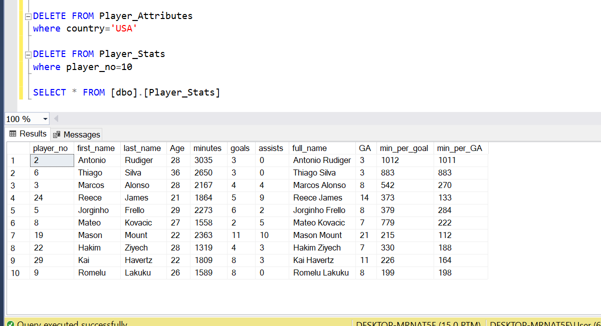

Now we can see that it has been effected.

The next on the list is to add another player into our player_Stats table, that will replace christian pulisic that was deleted.

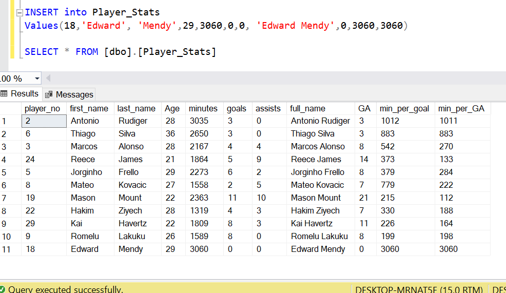

Now we want to add a new column into our player_Attributes column.

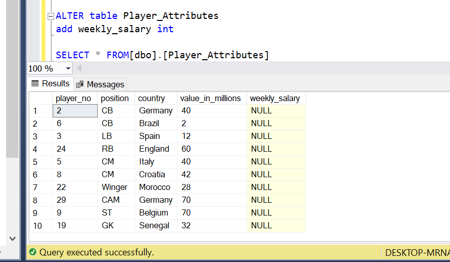

It has been effected, and it is empty 🧐 Lets Populate

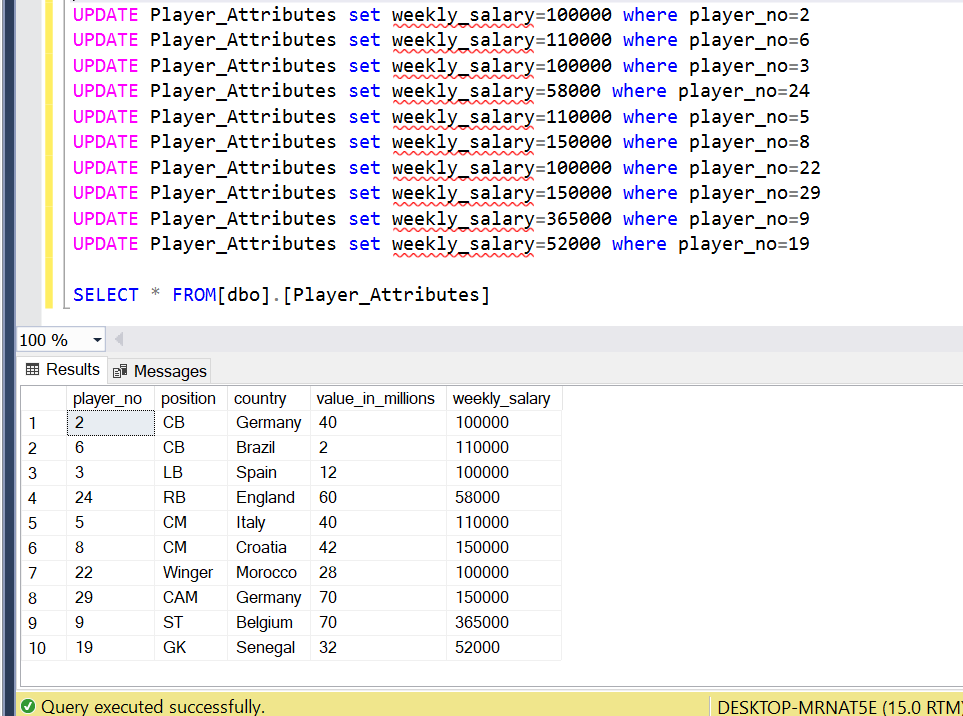

Looks like we are missing Mason mount in our Player_Attributes column. Lets add it and then proceed to join the 2 tables.

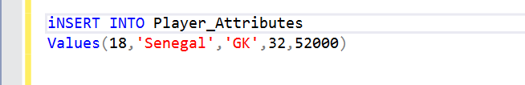

**Left join Syntax**                          
                           
We are going to be joining our 2 tables using the left join, and we will be joining it on the player_no which is the primary key. Lets have it ☺

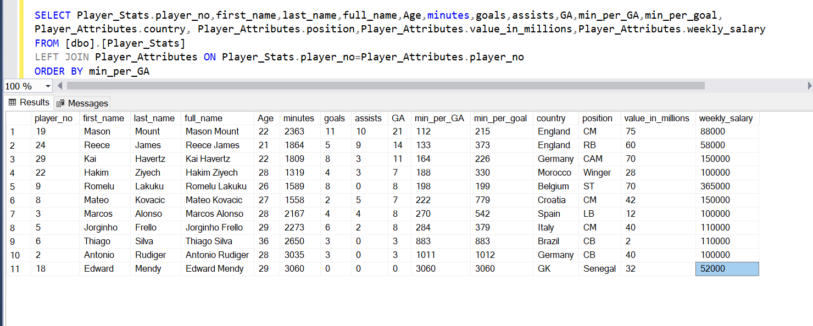

Alright! Bye for now 😇
