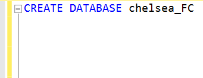

# SQL-Analysis-of-Chelsea-2021-2022-Season-

Hello there. I saw this Analysis on a die hard chelsea fan Project and decided to replicate and also give it a try :stuck_out_tongue_closed_eyes: The analysis of the  most used first 11 during the 2021–2022 season and play around with the data in SQL Server. Now lets get right into this :hand_over_mouth:

Lets start by creating our Database:

We can now see that the Database has been effected.

Now let us create 2 tables
- Player_Stats
- Player_Attributes

looks like our table will be empty :raised_eyebrow:
Lets Populate 

We can view our tables together right! Lets have a look

1.   Now let's add another column **Full-name**.
We want to Alter the table, so that other columns created will still be intact, and the command will just modify the table. We have it below 👇

After then, we can write the Concatenate function, to combine 2 of the columns together. The full_name and the last_name Column.

We can see that the change was effected. Aright!

2. The next column we will be adding is the **GA** Column i.e (goals+assists) still using the Alter command, i wanted to modify the table while still Updating it to automatically sum up the goals+assists column. Then we have this 👇

3. minutes_per_goal Column (goal/minutes)

4. minutes_per_GA (GA/minutes) 

Lets now view our newly added Columns.

Now, we want to **round** the newly added columns using the round function. see below 👇

minutes_per_goal column

minutes_per_GA column

Now, lets see the effects made

Let's drop the 2 Columns with decimal places
minutes_per_goal and minutes_per_GA Column

